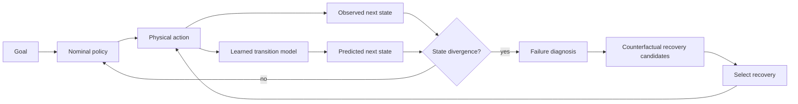
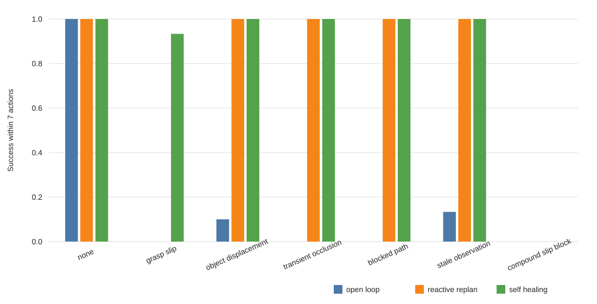

# Self-Healing Embodied Agents

[](https://github.com/sylvesterkaczmarek/self-healing-embodied-agents/actions/workflows/ci.yml)


Reproducible experiments on embodied agents that detect when physical execution diverges from expectation, infer a likely failure mode, evaluate recovery candidates and continue the task without restarting from scratch.

## At a glance

The central question is simple: **can an embodied agent recover earlier from silent physical failures by comparing predicted and observed state transitions?**



The default benchmark is deliberately small enough to reproduce on CPU. It includes a learned one-step transition model, controlled manipulation faults, reactive and open-loop baselines, counterfactual recovery, and an episodic-memory ablation.

## Results snapshot

The checked-in results come from **840 executed episodes**: 7 conditions × 10 seeds × 3 repetitions × 4 agent variants. Each method sees identical per-episode seeds and perturbations.

Across the 180 faulted episodes per method:

| Method | Eventual success | Success within 7 actions | Mean actions |
|---|---:|---:|---:|
| Open loop | 3.9% | 3.9% | 4.00 |
| Reactive replan | 100.0% | 66.7% | 6.59 |
| Self-healing | 100.0% | **82.2%** | **6.46** |
| Self-healing + memory | 100.0% | 82.2% | 6.63 |

For the self-healing agent, divergence detection achieved **96.7% precision** and **98.3% recall** against known injected failure windows in this synthetic benchmark.

The strongest positive result is bounded-horizon recovery. Reactive replanning eventually solves every faulted episode, but silent failures such as grasp loss are usually discovered one action later. The learned divergence detector often catches them immediately, increasing success within a seven-action budget from 66.7% to 82.2%.

The memory ablation is negative. The simple episodic recovery memory does not improve task success or seven-action success and slightly increases mean action count. It remains in the repository because negative ablations are useful evidence about what does not help.



The checked-in machine-readable summary is [`results/summary.csv`](results/summary.csv). A full reproduction also writes `results/summary.json` and `results/episodes.csv`.

## Method

The system separates anomaly detection from recovery planning.

1. A small PyTorch transition model is trained on nominal manipulation trajectories.
2. Before an action, the model predicts the next state.
3. After execution, the predicted and observed states are compared.
4. A calibrated residual threshold or explicit execution failure triggers recovery.
5. The mismatch is mapped to a failure class such as grasp loss, path obstruction or perception loss.
6. Candidate recovery sequences are rolled forward with a transparent symbolic skill model.
7. Candidates are scored by predicted completion, remaining goal distance, action cost and, optionally, episodic recovery evidence.
8. The selected recovery sequence resumes execution from the current state.

The learned model and counterfactual model are intentionally separate. The learned model provides an empirical divergence signal. The symbolic skill model keeps recovery scoring inspectable and prevents transition-model accuracy from being confused with recovery-policy quality.

See [`docs/method.md`](docs/method.md) for the full method description.

## Perturbations

The benchmark injects six controlled fault families plus a nominal condition:

- grasp slip during transport
- object displacement before grasp
- transient observation loss
- path obstruction
- stale observation after object movement
- compound obstruction and grasp loss

Each failure is recorded with a ground-truth event step so divergence detection can be evaluated against known fault windows.

## Baselines

**Open loop** executes the nominal skill sequence without recovery.

**Reactive replan** replans only after an action explicitly reports failure.

**Self-healing** also reacts to learned state divergence, allowing it to intervene before a later skill reports failure.

**Self-healing + memory** adds a small Beta-Bernoulli recovery-history prior. Its lack of benefit in the current benchmark is reported rather than hidden.

## Quick start

```bash
git clone https://github.com/sylvesterkaczmarek/self-healing-embodied-agents.git
cd self-healing-embodied-agents
python -m pip install -e .[dev]
make reproduce
```

`make reproduce` trains the transition model, runs the complete benchmark, regenerates the result figure and runs the test suite.

For a short recovery trace:

```bash
make demo
```

## Reproducibility

The default experiment configuration is checked in at [`configs/reproduce.json`](configs/reproduce.json).

- Python, NumPy and PyTorch seeds are fixed.
- deterministic PyTorch algorithms are requested during training
- perturbations use per-episode NumPy generators
- every episode is exported to CSV
- aggregate results are exported to CSV and JSON
- figures are regenerated from machine-readable outputs
- CI trains a small smoke model, runs tests and executes a recovery demo

See [`docs/reproducibility.md`](docs/reproducibility.md).

## Robotics integration

The core package has no simulator-specific dependency. Thin adapter boundaries are included under [`adapters/`](adapters/) for connecting the recovery logic to richer robotics environments or policy stacks.

The intended next validation step is to map the same interfaces onto a rigid-body benchmark such as ManiSkill or a policy/evaluation stack such as LeRobot, then repeat the perturbation study with image observations and continuous robot actions.

## Repository layout

```text
self-healing-embodied-agents/
├── adapters/                 # simulator and policy integration boundaries
├── artifacts/                # generated transition-model artifacts
├── configs/                  # machine-readable reproduction configuration
├── docs/                     # method, reproducibility and limitations
├── experiments/              # experiment notes
├── results/                  # real CSV, JSON and generated figure outputs
├── scripts/                  # training, benchmark, demo and reproduction entry points
├── src/
│   └── self_healing_embodied_agents/
│       ├── agents.py         # open-loop, reactive and self-healing agents
│       ├── benchmark.py      # experiment runner and aggregation
│       ├── env.py            # controlled manipulation testbed and perturbations
│       ├── plotting.py       # result figure generation
│       ├── recovery.py       # diagnosis, candidate generation, memory and scoring
│       ├── training.py       # deterministic transition-model training
│       ├── types.py          # states, actions and result records
│       └── world_model.py    # learned and symbolic world models
├── tests/
├── CITATION.cff
├── LICENSE
├── Makefile
├── pyproject.toml
└── README.md
```

## What this repository does not claim

This repository does not claim state-of-the-art robot control, real-world deployment safety or general recovery across arbitrary embodied tasks. The default environment is a controlled manipulation testbed rather than a rigid-body simulator, and the injected faults are synthetic.

The purpose is narrower: make state-divergence detection, failure diagnosis, recovery selection, bounded-horizon evaluation and recovery-memory ablation inspectable in one reproducible system.

See [`docs/limitations.md`](docs/limitations.md).

## Cite this repository

If you use or adapt this repository, please cite:

> Kaczmarek, S. (2026). *Self-Healing Embodied Agents*. GitHub. https://github.com/sylvesterkaczmarek/self-healing-embodied-agents

```bibtex
@software{Kaczmarek_2026_Self_Healing_Embodied_Agents,
  author = {Sylvester Kaczmarek},
  title  = {{Self-Healing Embodied Agents}},
  year   = {2026},
  url    = {https://github.com/sylvesterkaczmarek/self-healing-embodied-agents}
}
```

## License

MIT. See [LICENSE](LICENSE).

© **Sylvester Kaczmarek** · [https://www.sylvesterkaczmarek.com](https://www.sylvesterkaczmarek.com)
