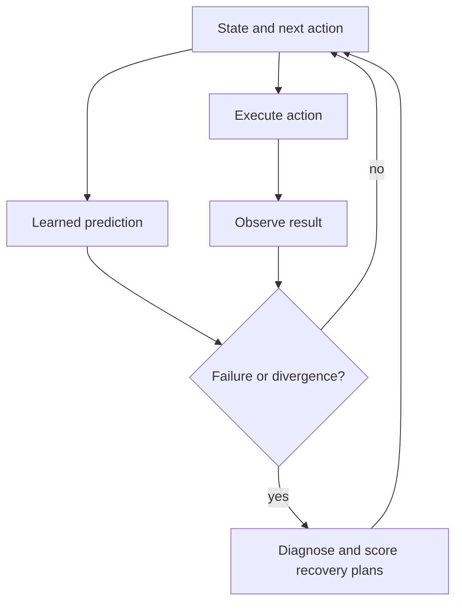
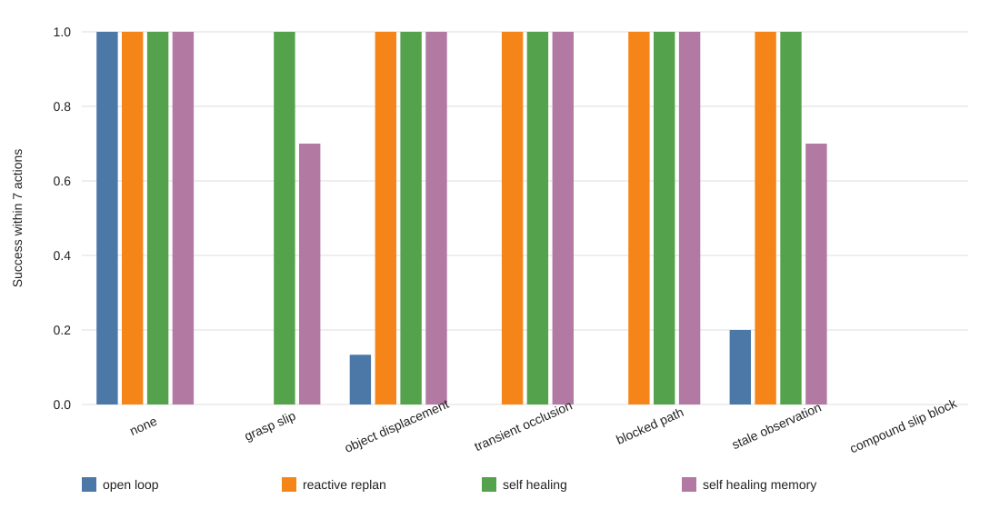

# Self-Healing Embodied Agents


[](https://github.com/sylvesterkaczmarek/self-healing-embodied-agents/actions/workflows/ci.yml)


A CPU benchmark for detecting and recovering from unexpected changes during a simulated object-moving task. It compares a fixed action sequence, reactive replanning, learned transition monitoring with recovery planning, and recovery planning with memory.

## At a glance

The agent predicts the next state before acting, checks what happened, and selects a recovery sequence when an action fails or its prediction differs enough from the observation.


```mermaid
flowchart TD
    A[State and next action] --> B[Learned prediction]
    A --> C[Execute action]
    C --> D[Observe result]
    B --> E{Failure or divergence?}
    D --> E
    E -- no --> A
    E -- yes --> F[Diagnose and score recovery plans]
    F --> A
```

The environment uses discrete skills and synthetic faults. Source code, a ready-to-use model checkpoint, complete episode traces and reproduction settings are included.

## Results snapshot

The checked-in reference contains **840 executed episodes**: 7 conditions × 10 root seeds × 3 repetitions × 4 methods. Methods share each root-seed/repetition pair's initial geometry and fault-generation rules. The table covers the **180 fault-condition episodes per method**.

| Method | Success within 24 actions | Success within 7 actions | Mean actions |
|---|---:|---:|---:|
| Open loop | 5.6% | 5.6% | 4.00 |
| Reactive replan | 100.0% | 66.7% | 7.02 |
| Self-healing | 100.0% | 83.3% | 6.72 |
| Self-healing + memory | 100.0% | 73.3% | 6.92 |

The self-healing agent completed 150 of 180 fault-condition episodes within seven actions, compared with 120 for reactive replanning. All 30 grasp-slip cases took seven actions for self-healing and eight for reactive replanning. Both methods eventually completed every reference task under the 24-action cap. These results compare their combined monitoring and recovery policies; they do not isolate the learned detector's contribution.

The separate controlled study below finds the same task outcomes with continuous
replanning and simple postcondition checks. The reference advantage over
failure-only replanning therefore does not establish an advantage from learning.

Adding memory reduced seven-action success from 83.3% to 73.3% and increased mean actions relative to the same agent without memory. This fixed-order ablation provides no overall advantage for memory in the reference run.

Self-healing detection had **82.4% pooled precision** (206 matched detections / 250 detections) and **98.1% pooled recall** (206 / 210 injected-fault steps). These scores include explicit action failures and use one-to-one matching within the current or preceding action. They measure the combined detection rule.

The seven-action column is a reporting cutoff on episodes executed with a 24-action limit. Mean actions include failed episodes. The study uses one trained model and paired evaluation geometries; no confidence interval or claim of general superiority is implied.



See the [episode records](results/episodes.csv), [full traces](results/episodes.jsonl) and [summary](results/summary.csv) for the underlying evidence. These regenerated results supersede the earlier snapshot after corrections to calibration, simulation, replanning and metric accounting.

## Controlled comparisons

A [separate pilot](results/comparison-v1/evaluation/summary.json) compares ten
methods across five training seeds and fourteen counterbalanced histories.
It includes 14,700 evaluation episodes and 2,940 memory-fitting episodes, with
disjoint development, fitting and evaluation seeds. Each method has 1,260 fault
episodes; all methods complete every task within 24 actions.

| Method | Mean actions on fault episodes |
|---|---:|
| Failure-only intervention with nominal replanning | 6.9802 |
| Replan after every observation | 6.6905 |
| Observable postcondition checks with nominal replanning | 6.6905 |
| Known nominal analytical residual with nominal replanning | 6.6905 |
| Learned residual with nominal replanning | 6.6905 |
| Learned residual with ranked recovery | 6.6905 |
| Ranked recovery with candidate-completion memory, online | 6.8079 |
| Ranked recovery with task-outcome memory, online | 6.9754 |
| Ranked recovery with candidate-completion memory, fitted and frozen | 6.7563 |
| Ranked recovery with task-outcome memory, fitted and frozen | 6.8151 |

Continuous replanning, postcondition checks, analytical residuals and both
learned variants without memory match success and action count in every paired
evaluation case. Earlier observation-based intervention explains the measured
advantage over failure-only intervention; the learned detector and ranked
candidate selection add no task-performance benefit in this testbed.

Memory increases mean action count under both protocols. The new task-outcome
objective is retained as an experimental negative comparison, not the default.
These results concern this memory design and do not demonstrate embodiment drift.

The learned nominal control saves 0.2897 actions relative to failure-only
replanning (paired pilot 95% interval 0.2738 to 0.3056). Intervals resample model
seeds and complete histories, not individual episodes. There are only 42 base
evaluation geometries; deterministic controls repeated across model seeds are
shared observations. Zero observed differences do not prove general equivalence.
The full completion curves, alarm sources, action costs and memory comparisons
are in the [summary](results/comparison-v1/evaluation/summary.json).

See the [method and reproduction commands](docs/method.md#controlled-comparisons)
and [study record](results/comparison-v1/study.json). The original reference
configuration, checkpoint, traces and results remain unchanged. The benchmark
still uses ideal-state observations and guaranteed symbolic repair skills.

## Method

1. Train a small transition model on nominal trajectories, keeping entire calibration episodes separate from training.
2. Compare predicted and observed next states using a calibrated residual threshold. Explicit action failures also trigger recovery.
3. Classify the mismatch and generate a small set of hand-written recovery sequences.
4. Forecast each sequence using the same nominal skill rules as the simulator, including grasp and placement tolerances and the remaining execution budget.
5. Score predicted task completion, object distance, action count and optional recovery history.
6. Execute the selected sequence and record whether it completes, is interrupted or runs out of actions.

Task completion and completion of a recovery sequence are separate outcomes. A successful re-observation can finish a recovery candidate while the object still needs moving. Every started candidate receives one outcome, including interrupted attempts.

The shared simulation/planning contract prevents the planner from assuming a grasp or placement can succeed when execution would reject it. Replanning skips moves whose destinations are already reached, so repeated alarms cannot trap it into repeating the same completed movement. Invalid states, thresholds and predictions fail clearly, and expired action budgets stop further execution.

See [the method](docs/method.md) for equations, detection matching and recovery-memory semantics.

## Perturbations and baselines

Six fault conditions accompany nominal execution: grasp slip, object displacement, temporary occlusion, path obstruction, stale observation, and compound obstruction followed by grasp slip. Temporary occlusion expires after two reads or an explicit re-observation. In the compound condition, slip occurs only after transport succeeds.

| Method | Behaviour |
|---|---|
| Open loop | Execute the initial skill sequence. |
| Reactive replan | Replan after an explicitly failed action. |
| Self-healing | Also react to learned state divergence and score recovery candidates. |
| Self-healing + memory | Add a candidate-completion history, reset for each evaluation root seed. |

Faults are triggered by actions, so different methods can encounter different realised event sequences even with the same seed. Ground-truth event steps support evaluation of detection timing.

## Quick start

Use Python 3.11 or later:

```bash
git clone https://github.com/sylvesterkaczmarek/self-healing-embodied-agents.git
cd self-healing-embodied-agents
python -m pip install -e ".[dev]"
python scripts/smoke_demo.py --perturbation compound_slip_block
```

The demo uses the checked-in checkpoint and prints executed actions, detections and recovery outcomes. To train and reproduce the full experiment in a separate directory:

```bash
OMP_NUM_THREADS=1 MKL_NUM_THREADS=1 python scripts/reproduce.py \
  --config configs/reproduce.json --out runs/reproduction
python -m pytest -q
```

`make demo` runs the saved model. `make reproduce` runs the full experiment under `runs/reproduction/` and then tests it. `make train` and `make benchmark` use `runs/local/`. Each command also has `--help`; see [reproduction instructions](docs/reproducibility.md) for checkpoint replay and shorter evaluations.

## Evidence and reproducibility

The reference model uses seed 7 with 700 nominal episodes and 180 training epochs. Its training and calibration partitions contain 560 and 140 whole episodes. Evaluation uses ten root seeds and three repetitions, paired across methods and conditions. Memory persists through a fixed condition order within each root seed.

The checked-in evidence includes:

- [Model checkpoint](artifacts/world_model.pt) and [calibration metrics](results/world_model_metrics.json).
- [Episode counters](results/episodes.csv) and [complete episode traces](results/episodes.jsonl).
- [CSV summary](results/summary.csv), [JSON summary](results/summary.json) and generated SVG figures.
- [Provenance](results/provenance.json) containing effective settings, source/checkpoint hashes, runtime versions and execution order.

Invalid seed lists, malformed configuration and nonfinite results are rejected. Undefined metric ratios use JSON `null`. Reproduction stages output before publication and restores previous files if ordinary publication fails. Use separate run directories for concurrent experiments.

## Scope and integration

This is a two-dimensional tabletop with instantaneous skills, direct state observations and known recovery rules. The study measures behaviour on synthetic faults. It does not establish real-robot safety, general task recovery or performance against large robot policies.

The single trained model, paired evaluation geometries and fixed memory order limit the conclusions. Detection includes explicit failure signals, and the seven-action measure is a reporting cutoff on episodes allowed to run for 24 actions. Detailed assumptions are in [limitations](docs/limitations.md).

The [adapter files](adapters/) are protocol sketches for future ManiSkill or LeRobot integration. They require concrete observation, controller and safety implementations before use with a simulator or robot. See [integration requirements](docs/integrations.md).

## Cite this repository

If you use or adapt this repository, please cite:

> Kaczmarek, S. (2026). *Self-Healing Embodied Agents*. GitHub. https://github.com/sylvesterkaczmarek/self-healing-embodied-agents

```bibtex
@software{Kaczmarek_2026_Self_Healing_Embodied_Agents,
  author = {Sylvester Kaczmarek},
  title  = {{Self-Healing Embodied Agents}},
  year   = {2026},
  url    = {https://github.com/sylvesterkaczmarek/self-healing-embodied-agents}
}
```

## License

MIT. See [LICENSE](LICENSE).

© **Sylvester Kaczmarek** · [https://www.sylvesterkaczmarek.com](https://www.sylvesterkaczmarek.com)
